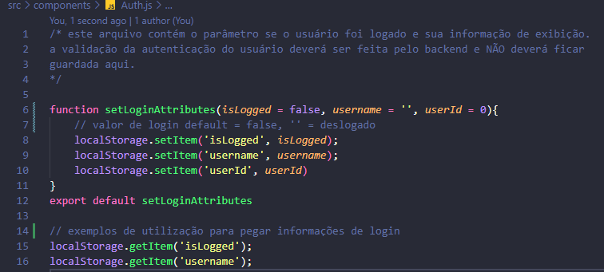
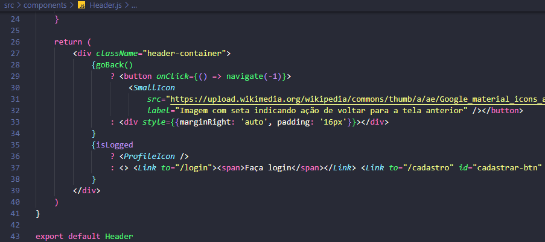
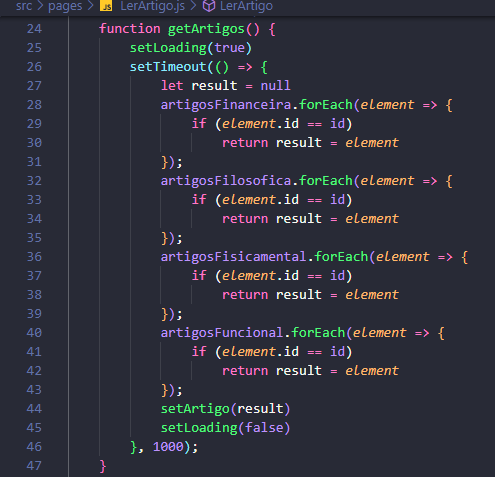
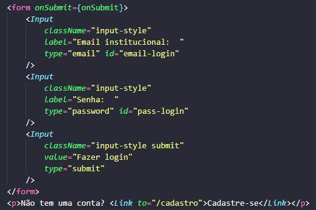
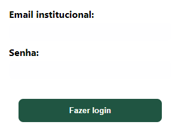

# Mini manual de componentes e utilização de arquivos
## PARA INICIAR O PROJETO DÊ O COMANDO:
> npm install

Este projeto está sem o node_modules, mas após executar o comando ele aparecerá no projeto.
Feito isso basta ir na pasta do projeto rodar 
> 'npm start'

## Verificação de login
A verificação de que o usuário fez login está no arquivo **src/components/Auth.js**.
Por hora, não há validação de login/cadastro e os dados recebidos ali são meramente estáticos
(Feitos como um mock de testes independente das entradas do usuário), mas podem ser usados normalmente sem alterações drásticas na pasta.

### Função para setar sessão do usuário:

  

Um exemplo de utilização deste recurso para setar o usuário de testes está nas telas de login e cadastro
que por horam passam os seguinte no OnSubmit:

>      setLoginAttributes(true, 'Usuário de Teste, Jorge', 1)

Futuramente poderemos atualizar o método Auth.js para que receba o email e senha utilizados pelo usuário, assim como
parâmetros passados por ele no Input:

> setLoginAttributes(true, user.nome, user.id, user.email, user.pass)

Essas informações serão capturadas pelas demais telas com um método get nativo do JavaScript (Ilustrado na figura Componente Auth)
Um exemplo de uso é no Header da aplicação, ao capturar o parâmetro resultado de
> localStorage.getItem('isLogged');

Podemos definir se queremos que nosso componente exibe a opção de fazer login/cadastro ou a opção de acessar o perfil
do usuário:

  

Os parâmetros default da aplicação para o usuário são respectivamente:
* isLogged = false
* username = ''
* userId = 0

Considerando isso, sempre que os parâmetros default da aplicação estiverem setados, o usuário estará desconectado.
Simulando um logout, bastaria chamar o método **setLoginAttributes()** sem passar nenhum parâmetro que automaticamente
ele atribuiria ao Application local os parâmetros default pré estabelecidos e o isLogged = false.

## Capturando Ids na URL
Na tela de Ler artigo, foi passado o Id do artigo na URL no formato ip:3000/ler/1, por exemplo.
A lógica de funcionamento desse comando funciona da seguinte forma:

* Na tela 'Explorar Artigos' cada item da lista de testes tem um id único;
* Quando clicamos em Ler Artigo, o programa irá capturar o id ao qual aquele item da lista se referencia e irá passá-lo na URL com o comando navigate:

 importamos o useNavigate: *import { useNavigate } from "react-router-dom"*
 instanciamos como: *const navigate = useNavigate()*

 e então criamos o método que será passado no OnClick:
 > const onLerArtigoBtn = id => { navigate(`/ler/${id}`) }

 * Então, na tela Ler Artigo, vamos pegar o parâmetro passado na URL com useParams:
 importamos o useParams: *import { useParams } from "react-router-dom"*

 e então criamos uma constante que irá armazenar os parâmetros encontrados na URL:

 **NOTA IMPORTANTE:** O parâmetro que pegamos com useParams deverá ter o mesmo nome que foi passado anteriormente,
 o método pode retornar mais itens da URL que o Id se assim quisermos, mas nesse caso optei por capturar somente o Id.

 > const params = useParams()

> const { id } = params

Com o const id recebendo o params, temos o id da postagem, e após isso basta buscá-la no banco de dados pelo id, por exemplo:

> SELECT * FROM artigos_tb WHERE id={id}

Ou da lista mockada que eu fiz para exemplificar, e que chama do array por meio de um forEach.

  

## Observação sobre os componentes
Os componentes criados podem ser usados para + de uma finalidade se acharem cabível. Eles podem ter seu style alterado também caso necessário.

### Input
O componente input servirá tanto para gerar um input estilizado como um submit, tudo dependerá do caso de uso.
Você pode invocar o componente '< Input/>' passando nele o type="text" e ele virá estilizado como um input de texto,
ou passar um type="submit" para que ele venha como um submit.

  

Você pode usar o design desses componentes em outros componentes como links, de maneira geral:
* className='input-style' -> Te retornará o estilo de um input de texto
* className='input-style submit' -> Te retornará o estilo de um botão de submit